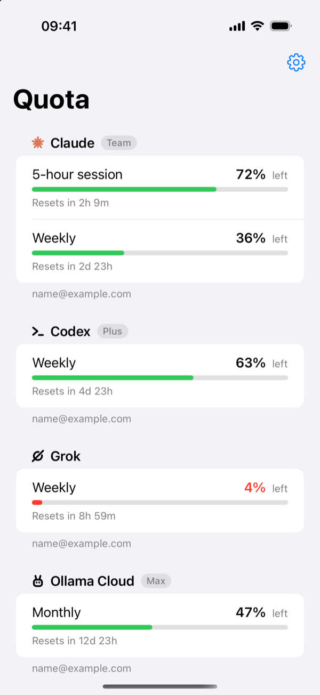
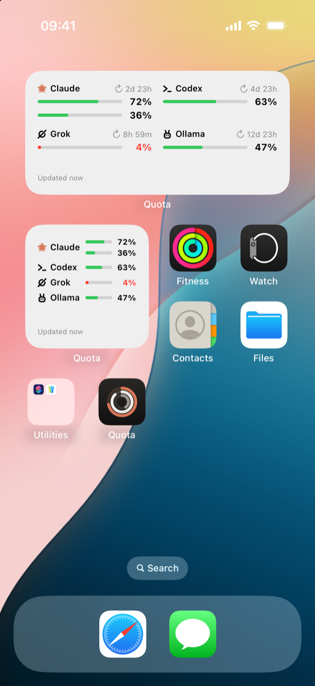

# Quota iOS

How much of your **Claude**, **Codex**, **Grok** and **Ollama Cloud** subscription limits you have left, on your iPhone: an app plus Home Screen and Lock Screen widgets.

<p>
  
  
</p>

The iOS companion of [Quota](https://github.com/turinglabsorg/quota), the macOS menu bar app ([Quotax](https://github.com/turinglabsorg/quotax) is the Linux version).

## How it works

Your phone has no CLIs to read limits from, so an always-on Mac does it: [`quota-server`](https://github.com/turinglabsorg/quota#iphone-app-and-widgets) reads the accounts linked on that Mac every 5 minutes and publishes them over HTTPS. The app and the widgets fetch those numbers with a device token. The phone never receives credentials for Claude, Codex, Grok or Ollama.

- **App**: every account with its windows (5-hour session, weekly, per-model weekly, monthly), bars and reset countdowns. Pull to refresh.
- **Widgets**: small and medium on the Home Screen; circular (the account closest to its limit), rectangular and inline on the Lock Screen. The 5-hour session and the weekly window appear as two stacked bars, like the Mac menu bar. They refresh themselves every 15 minutes and keep showing the last numbers, with their age, when the server is unreachable.
- **Pairing**: run `quota-server pair` on the Mac and enter the single-use 8-digit code in the app. The token lives in the Keychain, shared with the widgets.
- **Languages**: English and Italian.

## Requirements

- iPhone or iPad with iOS 17 or later
- A Mac running `quota-server` behind an HTTPS address (see [Quota](https://github.com/turinglabsorg/quota#iphone-app-and-widgets))
- To build: Xcode, [XcodeGen](https://github.com/yonaskolb/XcodeGen) (`brew install xcodegen`) and an Apple Developer team

## Build and install

```bash
git clone --recursive https://github.com/turinglabsorg/quota-ios.git
cd quota-ios
scripts/build-ios.sh                                   # simulator build
QUOTA_TEAM_ID=<your team id> scripts/build-ios.sh --install   # build and install on the connected iPhone
```

The iPhone needs Developer Mode (*Settings → Privacy & Security*) the first time.

To build with your own team, change `bundleIdPrefix`, the two `PRODUCT_BUNDLE_IDENTIFIER`s and `QUOTA_APP_GROUP` in [`project.yml`](project.yml).

## Development

- `project.yml` is the XcodeGen spec; the `.xcodeproj`, Info.plists and entitlements are generated by `scripts/build-ios.sh`.
- The models, formatting, server payload, provider glyphs and translations come from the macOS app through the `quota` git submodule, so both apps stay in sync. Update it with `git submodule update --remote quota`.
- `-QuotaSampleData` as a launch argument makes the app and the widgets show sample accounts (used for the screenshots).

Contributor notes for humans and coding agents are in [`AGENTS.md`](AGENTS.md).

## Disclaimer

Quota is an independent project and is not affiliated with, endorsed by or sponsored by Anthropic, OpenAI, xAI or Ollama. Claude, Codex, Grok and Ollama are trademarks of their respective owners.

## License

[MIT](LICENSE)
